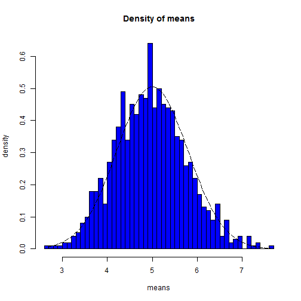
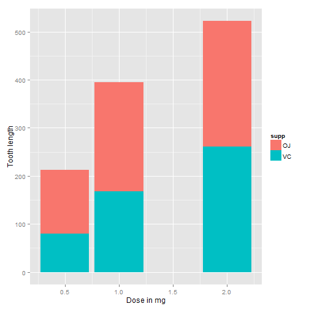

## Part I of the project

This is the first part of the assignment for the Statistical Inference Course. This part of the assignment is a simulation exercise of the exponential distribution, run in R. The assignment requires 1000 simulations of 40 averages of the exponential distribution with a parameter lambda=0.2.

## 1. Simulations
Here is the R code I used for the simulations.In the first step, 1000 simulations of the exponential distribution with size=40; this will produce a data frame with 40 observations (rows) and 1000 variables (columns). The second step finds the mean of each column and assigns it to a numeric vector called means

```r
set.seed(810)
nsim<-1000
n<-40
lambda<-0.2 
sdistr<-replicate(nsim, rexp(n, lambda))
means<-apply(sdistr,2,mean)
```

# 1.1. Compare the sample mean and the mean of the distribtions
As I have created my vector of means, I simply take the mean of it and find what it is (I call it analytical mean), then calculate what the mean of the population should be (call it theoretical mean). The code and output is the following. 


```r
analytical_mean<-mean(means)
analytical_mean
```

```
## [1] 4.960612
```

```r
theoretical_mean<-1/0.2
theoretical_mean
```

```
## [1] 5
```

The population mean (expected mean, or as I call it, theoretical mean) =1/lambda
 =1/0.2=5. As we see, the sample mean (analytical mean) in my case comes close to it, and equals 4.960612. Graphically, these values are shows on the histogram below showing the freequencies of the means.
Code producing the histogram:

```r
hist(means, xlab="mean", main="Exponential distribution simulations") 
abline(v=analytical_mean, col="blue", lwd=2) 
abline(v=theoretical_mean, col="red", lwd=2)
```

 

#1.2. Show how variable the sample is (via variance) and compare it to the theoretical variance of the distribution

In this part, I present the R code and output from the analytical and theoretical srandard deviations and variances. The analytical sd is simply the standard deviation of the numeric means vector. The theoretical one is (1/lambda)/\sqrt{n}. The two values are quite close to each other. To find the respective variances, we simply square each of the obtained standard deviations, and we see they are quite close, which is a sign our estimators would be consistent. 


```r
sd_analytical<-sd(means) 
sd_analytical 
```

```
## [1] 0.7925105
```

```r
sd_theoretical<-(1/lambda)/sqrt(n)
sd_theoretical 
```

```
## [1] 0.7905694
```

```r
var_analytical<-sd_analytical^2 
var_analytical 
```

```
## [1] 0.6280729
```

```r
var_theoretical<-sd_theoretical^2
var_theoretical
```

```
## [1] 0.625
```

Another figure showing variances (instead of means) of sample of 40 exponentially distributed random variables, simulated 1000 times. The colored lines show the analytical and the theoretical variances (since they are very close to each other and the overall spread is large, it is difficult to distinguish on the graph between the two. 


```r
variancess<-apply(sdistr,2,var) 
hist(variancess, xlab="Variance", main="Exponential distribution simulations") 
abline(v=var_theoretical, col="red", lwd=2) 
abline(v=var_analytical, col="blue", lwd=2) 
```

 

# 2. Show that the distribution is approximately normal
Here is the code producing the histogram showing the distribution of the data and a fitted line of a normal distribution. We see from the graph that the distribution approaches normal, which implies that the Central Limit Theorem holds. 


```r
xfit <- seq(min(means), max(means), length=100) 
yfit <- dnorm(xfit, mean=1/lambda, sd=(1/lambda/sqrt(n))) 
hist(means,breaks=n,prob=T,col="blue",xlab = "means",main="Density of means",ylab="density") 
lines(xfit, yfit, pch=22, col="black", lty=5)
```

 

##. Part II of the project

# 1. Load the ToothGrowth data and perform some basic exploratory analysis.
#2.Provide basic summary of the data.

I open the ToothGrowth data. The set contains 3 columns (variables) and 60 rows (observations). The variable len is numeric, supp is a factor and dose is numeric again. Some table summary statistics show that supp has two categories, VC an OJ, and there are 30 observations in each. The dose takes three different values: 0.5, 1 and 2. There is an equal number of observations, that is 20 in each. The len variable ranges from 4.2 to 33.9, with a mean of 18.81333 and sd of 7.649315. Subsequently, a basic plot is presented ( of the dose variable on the x-axis and the tooth growth, i.e. len on the y-axis, and by the supp). 

```r
library(datasets) 
data(ToothGrowth)
str(ToothGrowth)
```

```
## 'data.frame':	60 obs. of  3 variables:
##  $ len : num  4.2 11.5 7.3 5.8 6.4 10 11.2 11.2 5.2 7 ...
##  $ supp: Factor w/ 2 levels "OJ","VC": 2 2 2 2 2 2 2 2 2 2 ...
##  $ dose: num  0.5 0.5 0.5 0.5 0.5 0.5 0.5 0.5 0.5 0.5 ...
```

```r
head(ToothGrowth)
```

```
##    len supp dose
## 1  4.2   VC  0.5
## 2 11.5   VC  0.5
## 3  7.3   VC  0.5
## 4  5.8   VC  0.5
## 5  6.4   VC  0.5
## 6 10.0   VC  0.5
```

```r
x<-ToothGrowth$dose 
y<-ToothGrowth$supp
table(x) 
```

```
## x
## 0.5   1   2 
##  20  20  20
```

```r
table(y) 
```

```
## y
## OJ VC 
## 30 30
```

```r
len<-ToothGrowth$len 
mean(len) 
```

```
## [1] 18.81333
```

```r
sum(len)
```

```
## [1] 1128.8
```

```r
range(len)
```

```
## [1]  4.2 33.9
```

```r
sd(len)
```

```
## [1] 7.649315
```

```r
library(ggplot2)
ggplot(ToothGrowth, aes(x,len, fill=supp))+geom_bar(stat="identity",) + xlab("Dose in mg")+ylab("Tooth length")
```

 

#3. Use confidence intervals and/or hypothesis tests to compare tooth growth by supp and dose. (Only use the techniques from class, even if there's other approaches worth considering) 
# 4.State your conclusions and the assumptions needed for your conclusions. 

First, I perform a t-test (a Welch two-sample) to whether the growth (the variable len) differes by supp, that is whether the difference in means in the len by the groups is statistically different. As we know, we have two categories of the supp variable. However, for the dose variable, we have 3 categories (or levels) and we cannot have three levels with the Wlech test, so we need to subset a smaller dataset there and investigate whether the length differs by, say by the smallest and the highest dose, that is 0.5 and 2, respectively. Options in these test are whether the observations are paired, which is false in both cases, and whether the variances are equal or not. We do not impose the equal variances assumptions. The output so far is given with the following R code. 

In the first test, the t-statistic is 1.92, 95% confidence interval includes the zero value, and the p-value is around 0.06. Therefore, we will fail to reject the null hypothesis at 95% confidence. The p-value shows that the the two means would be statistically different from each other at the 10% level of signficance, however. 

The second t-test shows a much more substantial difference in the means of the two categories of doses. The zero value does no belong to the confidence interval, the t-statistic is very high with a super small p-value. In this case, we confidently reject the null of equal means across the two groups. Of course, in an identical way, we could compare those receiving dose of 0.5 with those receving dose of 1, and the latter with those receiving a dose of 2.   


```r
t.test(len~y, paired=FALSE, var.equal=FALSE,data=ToothGrowth)
```

```
## 
## 	Welch Two Sample t-test
## 
## data:  len by y
## t = 1.9153, df = 55.309, p-value = 0.06063
## alternative hypothesis: true difference in means is not equal to 0
## 95 percent confidence interval:
##  -0.1710156  7.5710156
## sample estimates:
## mean in group OJ mean in group VC 
##         20.66333         16.96333
```

```r
#Subsetting the data and performing t-test by doses of 0.5 and 2
smalld<-subset(ToothGrowth, x %in% c(0.5, 2))
t.test(len~smalld$dose, paired=FALSE, var.equal=FALSE,data=smalld)
```

```
## 
## 	Welch Two Sample t-test
## 
## data:  len by smalld$dose
## t = -11.799, df = 36.883, p-value = 4.398e-14
## alternative hypothesis: true difference in means is not equal to 0
## 95 percent confidence interval:
##  -18.15617 -12.83383
## sample estimates:
## mean in group 0.5   mean in group 2 
##            10.605            26.100
```
